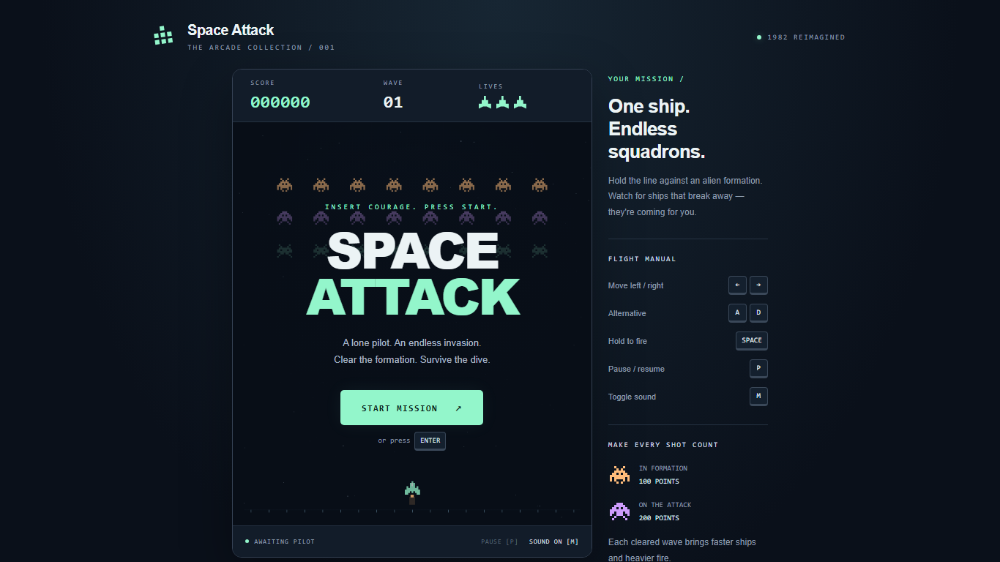
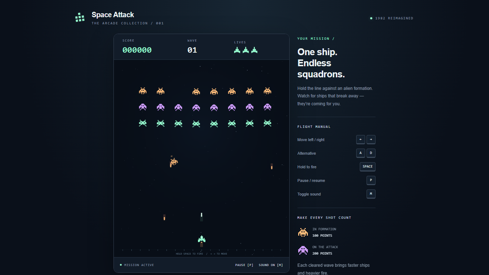
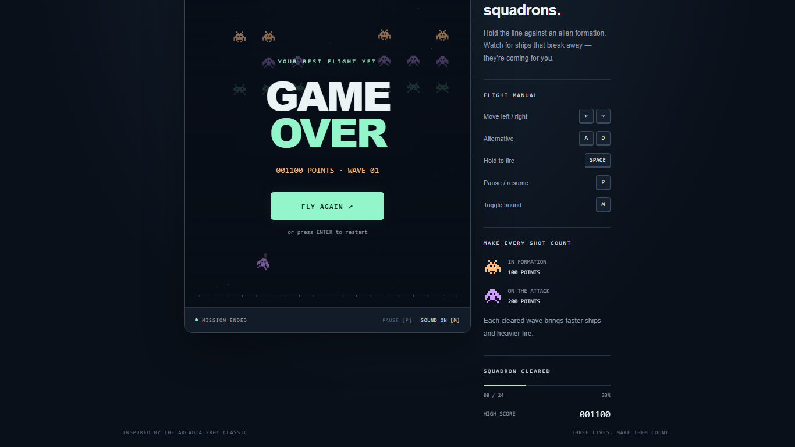

# Space Attack

A modern browser take on **Space Attack** (1982) for the **Emerson Arcadia 2001**. [Play it](https://blugart-dev.github.io/space-attack/).

## Features

- Enemy formations, diving attacks, and increasingly difficult waves.
- Score, three lives, respawn protection, and a saved high score.
- Start, game-over, restart, and pause screens; automatic pause on focus loss.
- Canvas graphics and synthesized arcade sound effects with a mute toggle.

## Screenshots

Start screen, active combat, and game over with a saved high score (1366 × 768).





## Controls

| Key | Action |
| --- | --- |
| Left/right arrows or A/D | Move |
| Hold Space | Fire |
| Enter | Start, restart, or resume |
| P or Escape | Pause/resume |
| M | Mute/unmute |

## Run locally

From the project directory, run:

```sh
python -m http.server 8000 --bind 127.0.0.1
```

Open [localhost:8000](http://localhost:8000) in Chrome. Native ES modules require HTTP, so opening `index.html` directly will not work. No installation or build step is needed.

## Project structure

```text
index.html       Page structure, HUD, and overlays
styles.css       Styling and responsive layout
src/
  main.js        Initialization, input, and animation loop
  config.js      Constants and difficulty parameters
  game.js        State, simulation, collisions, and waves
  renderer.js    Sprites and Canvas drawing
  audio.js       Synthesized effects and mute state
  ui.js          HUD, screens, and announcements
```

## Design decisions

- Plain HTML, CSS, and six ES modules keep responsibilities clear without a framework.
- A fixed simulation timestep keeps gameplay speed consistent across refresh rates; swept collision checks cover projectile movement between steps.
- Game graphics and audio are generated in code; gameplay loads no image or audio files.

## Known limitations

- Keyboard only; no touch or gamepad controls.
- Mute preference is not saved across page refreshes.
- High scores are stored per browser and site origin, not shared online. If localStorage is unavailable, the record lasts only for the current page.

## Development

Built with Codex. Development prompts: [prompts.md](./prompts.md).
